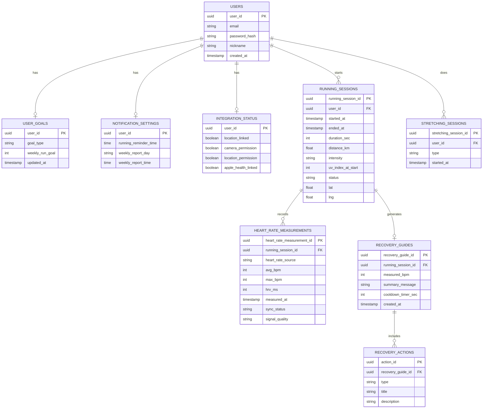

# 📊 AfterGrow DB ERD

## Mermaid 다이어그램



---

## DB 구조 설명

이 ERD는 러닝 세션 진행 → 심박수 측정 → 회복 가이드로 이어지는 앱의 핵심 흐름을 중심으로 설계되어 있습니다.

### 핵심 테이블

**USERS** — 모든 데이터의 시작점입니다. 나머지 테이블은 전부 직접 또는 간접적으로 `user_id`를 참조합니다.

**RUNNING_SESSIONS** — 러닝 한 회차를 나타내는 테이블입니다. 시작/종료 시각, 거리, 강도, 시작 시점 UV 지수 등을 담고 있으며, 이후 심박수 측정과 회복 가이드가 모두 이 세션 하나에 연결됩니다.

**HEART_RATE_MEASUREMENTS** — 하나의 러닝 세션에 여러 번 측정될 수 있는 구조입니다(워치 연동 실패 시 rPPG로 재측정하는 경우 등). 그래서 `RunningSession : HeartRateMeasurement = 1 : N`입니다.

**RECOVERY_GUIDES / RECOVERY_ACTIONS** — 러닝이 끝난 후 생성되는 AI 회복 가이드입니다. 가이드 하나에 "수분 보충", "쿨다운 스트레칭" 같은 액션이 여러 개 붙을 수 있어 두 테이블로 분리했습니다.

### 사용자 설정 테이블 (1:1 관계)

**USER_GOALS**, **NOTIFICATION_SETTINGS**, **INTEGRATION_STATUS**는 사용자 한 명당 정확히 한 행만 존재합니다. 그래서 `user_id`를 PK이자 FK로 동시에 사용해서 1:1 관계를 표현했습니다.

### 관계 요약

```
USERS ── 1:1 ── USER_GOALS / NOTIFICATION_SETTINGS / INTEGRATION_STATUS
USERS ── 1:N ── RUNNING_SESSIONS, STRETCHING_SESSIONS
RUNNING_SESSIONS ── 1:N ── HEART_RATE_MEASUREMENTS
RUNNING_SESSIONS ── 1:0..1 ── RECOVERY_GUIDES
RECOVERY_GUIDES ── 1:N ── RECOVERY_ACTIONS
```

### 설계 시 참고한 원칙

- 하나의 사용자 설정 정보(목표, 알림, 연동 상태)를 하나의 테이블에 몰아넣지 않고 성격별로 분리 — 각각 다른 화면(프로필/설정)에서 독립적으로 수정되기 때문
- 배열 형태 데이터(`RecoveryGuide.actions[]`)는 JSON 컬럼 대신 별도 테이블로 정규화 — 추후 액션별 통계를 뽑거나 조건별 필터링이 쉬워짐
